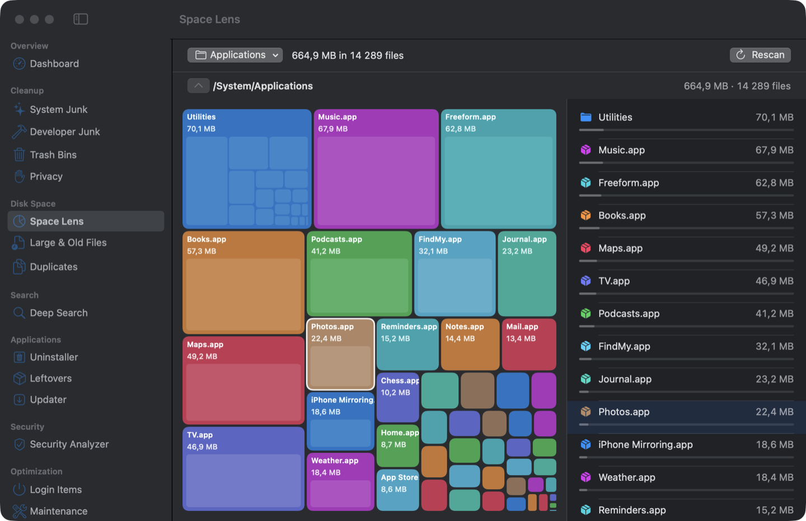
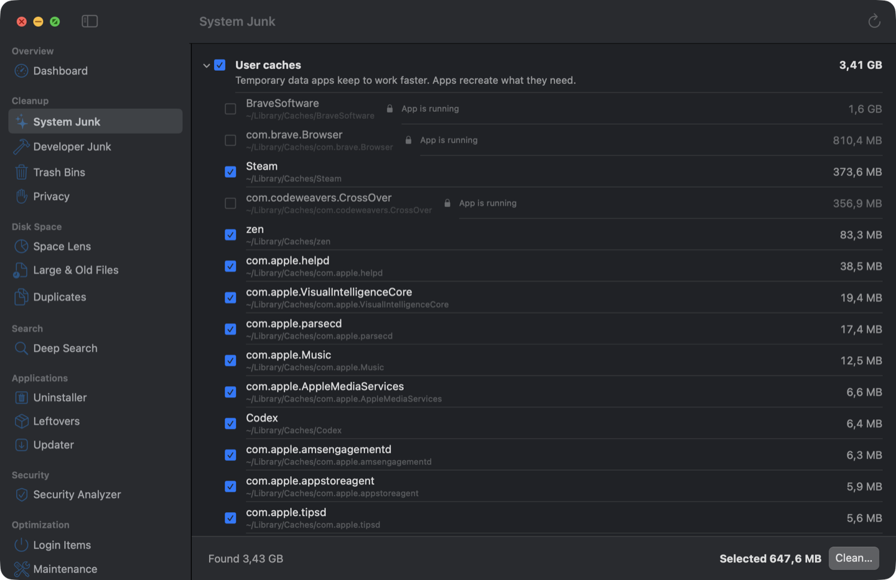
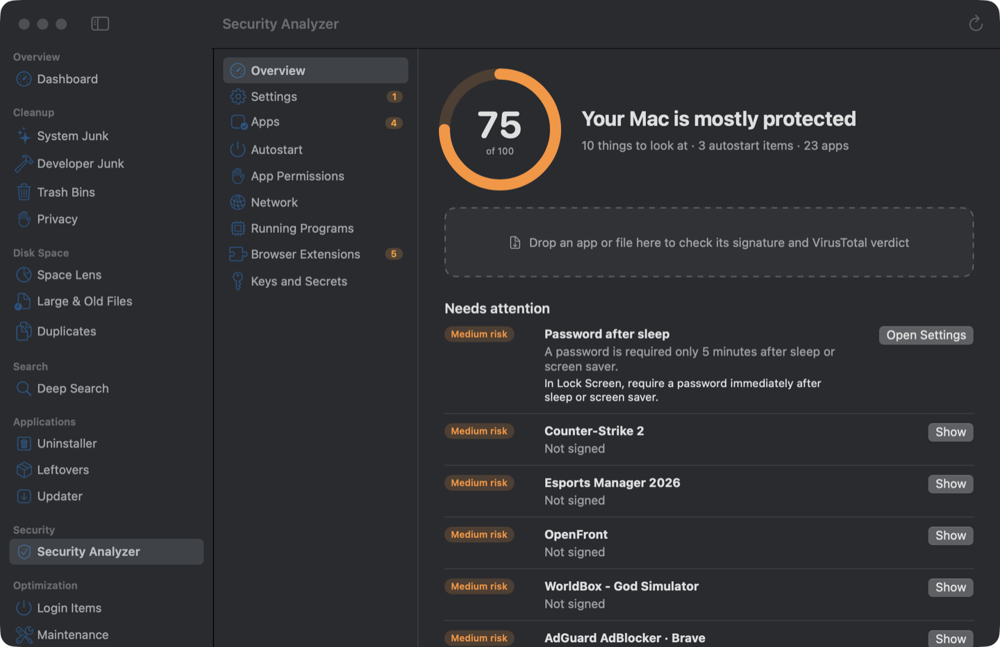

<div align="center">


# MacUtil

**A free, open-source cleaner, optimizer and security analyzer for macOS**

In the spirit of CleanMyMac, OnyX and the Objective-See tools. Native Swift and SwiftUI, no telemetry, no subscription.

[](#requirements)
[](#requirements)
[](LICENSE)
[](https://github.com/FixerHack/MacUtil/releases/latest)

**English** · [Українська](README.uk.md)

[Install](#install) · [First launch](#first-launch) · [Updates](#updates) · [Features](#features) · [Safety](#safety-and-privacy) · [Build from source](#build-from-source)



</div>

> [!IMPORTANT]
> **First launch:** MacUtil is not notarized by Apple, so macOS blocks it the first time you open it.
> Open it once, then go to **System Settings → Privacy & Security → Open Anyway**.
> You do this once: [later updates install themselves](#updates) from inside MacUtil, without the prompt.
> [Step by step ↓](#first-launch)

## Install

### Homebrew (recommended)

```bash
brew tap fixerhack/macutil
brew install macutil
```

The first command adds the MacUtil tap once; after that `brew install`, `brew upgrade` and `brew uninstall` work with the short name. To remove MacUtil, run `brew uninstall macutil`; add `--zap` to also delete its settings and history.

Or in one line, without adding the tap first: `brew install --cask fixerhack/macutil/macutil`.

### Download

1. Open the [latest release](https://github.com/FixerHack/MacUtil/releases/latest) and download **MacUtil-x.y.z.zip**.
2. Double-click the zip and drag **MacUtil** into your **Applications** folder.
3. Follow [First launch](#first-launch) below.

A **DMG** with the same app is attached to every release, with the first-launch steps drawn in its
window. macOS checks a downloaded disk image on its own, so the DMG asks about Gatekeeper twice:
once for the image and once for the app. The zip asks once.

<p align="center"></p>

Run MacUtil from Applications. Its permissions are tied to that copy.

## First launch

MacUtil is signed but not notarized by Apple (notarization needs a paid developer account), so macOS blocks it the first time:

> [!WARNING]
> 1. Open MacUtil. macOS says it cannot verify the app. Click **Done**, not Move to Trash.
> 2. Open **System Settings → Privacy & Security** and scroll down to **Security**.
> 3. Next to "“MacUtil” was blocked to protect your Mac", click **Open Anyway** and confirm with your password.

You do this once. If you prefer the Terminal, this does the same:

```bash
xattr -dr com.apple.quarantine /Applications/MacUtil.app
```

After that, MacUtil walks you through granting **Full Disk Access**. Without it, macOS hides caches, mail and browser data. The guide opens the right settings page, shows where to drag the app and notices by itself when access is granted.

## Updates

MacUtil checks its own GitHub releases once a day and shows a card on the dashboard when a new
version is out. Press **Update Now** and it downloads the release, replaces itself and restarts.
You can turn the check off, or run it by hand, in **Settings → Updates**.

Because MacUtil downloads the update itself instead of a browser, the new version carries no
quarantine flag, so it opens without the Gatekeeper prompt from the first install.

Two things are checked before anything is installed: the download must match the sha256 GitHub
publishes for it, and the new app must satisfy this copy's own code signature requirement. A build
signed by anyone else is refused, so a tampered download cannot replace your MacUtil.

## Features

<table>
<tr><td width="50%">

**🧹 Cleanup**
- System junk: caches, logs, temporary files
- Developer junk: Xcode, Simulators, npm, pip, Homebrew, Docker…
- Trash bins on every disk
- Privacy: browser history, recent items

**💽 Disk space**
- Space Lens: an interactive map of the disk
- Large and old files
- Duplicates, counting what APFS clones really free

**🔍 Deep search**
- By name, pattern, size, date or text inside files
- Covers hidden and system folders that Spotlight skips

</td><td width="50%">

**📦 Applications**
- Uninstaller that also removes leftover files
- Leftovers from apps that are already gone
- Updates from Sparkle feeds, Homebrew and the App Store

**🛡 Security analyzer**
- Code signatures and notarization of every app
- Autostart items, app permissions, network, running programs
- System security settings: FileVault, firewall, SIP, Gatekeeper…
- Browser extensions and keys left in plain text
- VirusTotal verdicts by file hash
- Settle a finding: a clean VirusTotal verdict or your own "I trust this" takes it out of the
  list and the score, and it returns if the file changes

**⚡ Optimization**
- Login items with on/off switches
- Maintenance scripts, DNS cache, Spotlight rebuild
- Hidden macOS settings and a process list
- Menu bar monitor for CPU, memory, disk, network and battery
- Smart Scan to run everything at once

</td></tr>
</table>

<p align="center">


</p>

The interface is available in English and Ukrainian and follows the macOS language setting.

## Safety and privacy

- **Nothing is deleted without asking.** Cleanup goes to the Trash by default, and you can undo it from the result screen. Deleting permanently is a separate choice that asks again.
- **Protected places are never touched:** system folders, keychains, iCloud Drive, the Photos library, `.git` folders.
- **Caches of running apps are locked** until you quit the app.
- **VirusTotal gets only file hashes.** A file is uploaded only when you explicitly ask. Your API key stays in the macOS Keychain.
- **No telemetry, no accounts, no network calls** except VirusTotal and update checks, both of which you start yourself.
- Every action is recorded in `~/Library/Application Support/MacUtil/History.jsonl`.

### VirusTotal

The security analyzer can check apps against VirusTotal. To enable it, create a free account at [virustotal.com](https://www.virustotal.com), copy your API key from your profile and paste it into **MacUtil → Settings**.

## Requirements

- macOS 14 Sonoma or later. On macOS 26 and later it uses the Liquid Glass design.
- A Mac with Apple Silicon or Intel.

## Build from source

You need Xcode 26 or later, or just the Command Line Tools with Swift 6.

```bash
git clone https://github.com/FixerHack/MacUtil.git
cd MacUtil
scripts/install.sh      # optimized build, installed to /Applications and opened
```

| Script | What it does |
|---|---|
| `scripts/build-app.sh [release]` | Builds `build/MacUtil.app` (`UNIVERSAL=1` for Apple Silicon + Intel) |
| `scripts/test.sh` | Runs the tests (works without Xcode) |
| `scripts/check-strings.sh` | Lists interface strings missing a Ukrainian translation |
| `scripts/snapshot.sh` | Saves a PNG of the app window (debug builds) |
| `scripts/release.sh [publish]` | Packs a universal build as DMG and zip, publishes a release and the Homebrew cask |

### Signing

The build script signs with the first **Apple Development** certificate in your keychain. You can get one for free by signing in with your Apple ID in Xcode → Settings → Accounts. Without a certificate the app is signed ad-hoc. That works too, but macOS forgets Full Disk Access after every rebuild because the signature changes.

If `security find-identity -v -p codesigning` lists your certificate as not valid, the Apple WWDR G3 intermediate certificate is missing. Download [AppleWWDRCAG3.cer](https://www.apple.com/certificateauthority/AppleWWDRCAG3.cer) and double-click it.

### Command line

`mucli` exposes the core for the Terminal. Every command is read-only:

```bash
swift run mucli junk          # what MacUtil would clean
swift run mucli security      # security settings, autostart items, signatures
swift run mucli large ~       # large and old files
swift run mucli --help
```

## Project layout

```
Sources/
  CleanerCore/    scanning, junk rules, cleaning, duplicates, search, apps
  SecurityCore/   signatures, permissions, persistence, VirusTotal, settings audit
  MacUtilApp/     SwiftUI app
  mucli/          command-line tool
Tests/            unit tests for both cores
```

## License

[GPL-3.0](LICENSE). You may use, study, change and share MacUtil. Changed versions you distribute must stay open under the same license.
