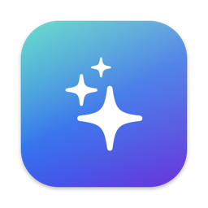
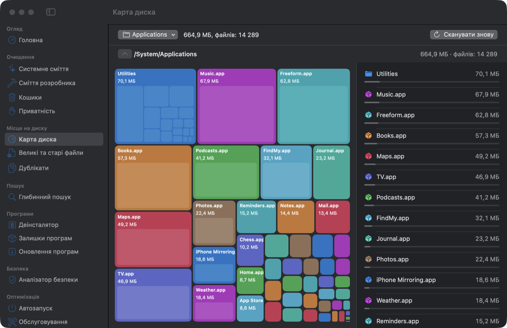
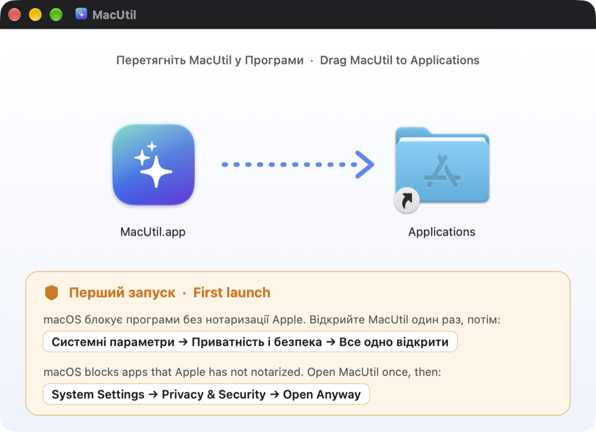
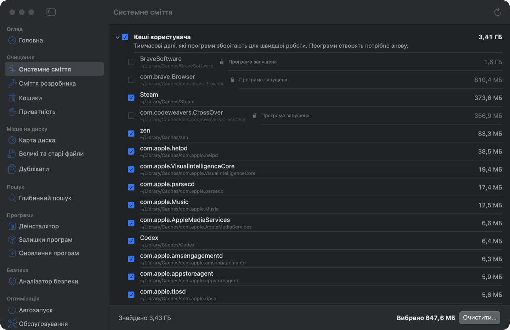
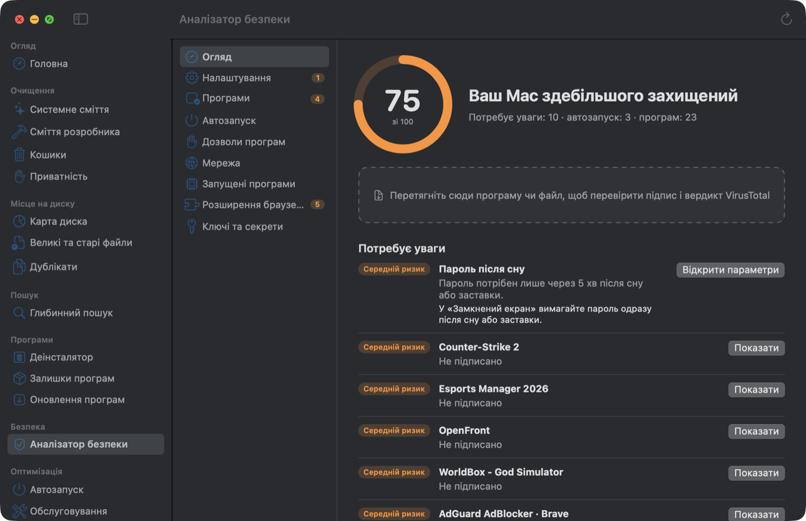

<div align="center">



# MacUtil

**Безкоштовний відкритий очищувач, оптимізатор і аналізатор безпеки для macOS**

У дусі CleanMyMac, OnyX та інструментів Objective-See. Нативний Swift і SwiftUI, без телеметрії й без підписки.

[](#вимоги)
[](#вимоги)
[](LICENSE)
[](https://github.com/FixerHack/MacUtil/releases/latest)

[English](README.md) · **Українська**

[Встановлення](#встановлення) · [Перший запуск](#перший-запуск) · [Оновлення](#оновлення) · [Можливості](#можливості) · [Безпека](#безпека-та-приватність) · [Збирання з коду](#збирання-з-вихідного-коду)



</div>

> [!IMPORTANT]
> **Перший запуск:** MacUtil не нотаризований Apple, тому macOS блокує його під час першого відкриття.
> Відкрийте програму один раз, потім **Системні параметри → Приватність і безпека → Все одно відкрити**.
> Це потрібно лише один раз: [наступні оновлення](#оновлення) MacUtil встановлює сам, уже без цього запиту.
> [Покроково ↓](#перший-запуск)

## Встановлення

### Homebrew (рекомендовано)

```bash
brew tap fixerhack/macutil
brew install macutil
```

Перша команда один раз додає tap MacUtil. Після цього `brew install`, `brew upgrade` і `brew uninstall` працюють з коротким іменем. Видалити: `brew uninstall macutil`. Додайте `--zap`, щоб прибрати також налаштування та історію.

Або одним рядком, без окремого додавання tap: `brew install --cask fixerhack/macutil/macutil`.

### Завантаження

1. Відкрийте [останній реліз](https://github.com/FixerHack/MacUtil/releases/latest) і завантажте **MacUtil-x.y.z.zip**.
2. Двічі клацніть zip і перетягніть **MacUtil** у теку **Програми**.
3. Виконайте кроки з розділу [Перший запуск](#перший-запуск).

До кожного релізу додається й **DMG** з тією самою програмою, а кроки першого запуску намальовані
просто у вікні образу. Але macOS перевіряє завантажений образ окремо, тому з DMG запит безпеки
з'явиться двічі: спершу для образу, потім для програми. Із zip він буде один.

<p align="center"></p>

Запускайте MacUtil саме з теки «Програми»: дозволи прив'язані до цієї копії.

## Перший запуск

MacUtil підписаний, але не нотаризований Apple (для нотаризації потрібен платний акаунт розробника). Тому під час першого запуску macOS його блокує:

> [!WARNING]
> 1. Відкрийте MacUtil. macOS повідомить, що не може перевірити програму. Натисніть **Готово**, а не «Перемістити в Кошик».
> 2. Відкрийте **Системні параметри → Приватність і безпека** та прокрутіть до розділу **Безпека**.
> 3. Біля напису «MacUtil» заблоковано з метою захисту вашого Mac» натисніть **Все одно відкрити** і підтвердьте паролем.

Це потрібно зробити лише один раз. Те саме можна зробити в Терміналі:

```bash
xattr -dr com.apple.quarantine /Applications/MacUtil.app
```

Далі MacUtil покроково допоможе надати **повний доступ до диска**. Без нього macOS приховує кеші, пошту та дані браузерів. Помічник відкриває потрібну сторінку налаштувань, показує, куди перетягнути програму, і сам помічає, коли доступ надано.

## Оновлення

MacUtil раз на день перевіряє власні релізи на GitHub і показує картку на головному екрані, коли
виходить нова версія. Натискаєте «Оновити зараз» — програма завантажує реліз, замінює себе й
перезапускається. Перевірку можна вимкнути або запустити вручну в розділі **Параметри → Оновлення**.

Оскільки MacUtil завантажує оновлення сам, а не браузер, на новій версії немає позначки карантину,
і вона відкривається без запиту безпеки, який був під час першого встановлення.

Перед встановленням перевіряються дві речі: файл має збігатися з хешем sha256, який публікує GitHub,
і нова програма має відповідати вимозі підпису цієї копії. Збірку, підписану кимось іншим, буде
відхилено, тож підмінений файл не замінить вашу програму.

## Можливості

<table>
<tr><td width="50%">

**🧹 Очищення**
- Системне сміття: кеші, журнали, тимчасові файли
- Сміття розробника: Xcode, симулятори, npm, pip, Homebrew, Docker…
- Кошики на всіх дисках
- Приватність: історія браузерів, недавні об'єкти

**💽 Місце на диску**
- Карта диска: інтерактивна мапа того, що займає місце
- Великі та старі файли
- Дублікати з урахуванням того, скільки реально звільнять клони APFS

**🔍 Глибинний пошук**
- За назвою, шаблоном, розміром, датою або текстом усередині файлів
- Шукає і в прихованих та системних теках, які пропускає Spotlight

</td><td width="50%">

**📦 Програми**
- Деінсталятор, що прибирає й залишкові файли
- Залишки програм, яких уже немає
- Оновлення через Sparkle, Homebrew та App Store

**🛡 Аналізатор безпеки**
- Підписи коду та нотаризація кожної програми
- Автозапуск, дозволи програм, мережа, запущені процеси
- Системні налаштування безпеки: FileVault, брандмауер, SIP, Gatekeeper…
- Розширення браузерів і ключі, збережені відкритим текстом
- Вердикти VirusTotal за хешем файлу

**⚡ Оптимізація**
- Автозапуск з перемикачами
- Обслуговування: DNS-кеш, переіндексація Spotlight тощо
- Приховані налаштування macOS і список процесів
- Монітор у рядку меню: процесор, пам'ять, диск, мережа, батарея
- Розумне сканування, щоб перевірити все одразу

</td></tr>
</table>

<p align="center">


</p>

Інтерфейс доступний українською та англійською і відповідає мові системи.

## Безпека та приватність

- **Нічого не видаляється без запиту.** За замовчуванням очищення переносить файли в Кошик, і його можна скасувати з екрана результату. Остаточне видалення обирається окремо й перепитує ще раз.
- **Захищені місця не чіпаються ніколи:** системні теки, зв'язки ключів, iCloud Drive, бібліотека Фото, теки `.git`.
- **Кеші запущених програм заблоковані**, доки програму не закрито.
- **VirusTotal отримує лише хеші файлів.** Сам файл вивантажується тільки на ваш прямий запит. API-ключ зберігається у Зв'язці ключів macOS.
- **Без телеметрії, акаунтів і мережевих запитів**, окрім VirusTotal і перевірки оновлень. Обидва ви запускаєте самі.
- Кожна дія записується в `~/Library/Application Support/MacUtil/History.jsonl`.

### VirusTotal

Аналізатор безпеки вміє перевіряти програми через VirusTotal. Щоб увімкнути це, зареєструйтеся безкоштовно на [virustotal.com](https://www.virustotal.com), скопіюйте API-ключ зі свого профілю та вставте його в **MacUtil → Параметри**.

## Вимоги

- macOS 14 Sonoma або новіша. На macOS 26 і новіших використовується дизайн Liquid Glass.
- Mac з Apple Silicon або Intel.

## Збирання з вихідного коду

Потрібен Xcode 26 або новіший, або лише Command Line Tools зі Swift 6.

```bash
git clone https://github.com/FixerHack/MacUtil.git
cd MacUtil
scripts/install.sh      # оптимізована збірка, встановлюється в /Applications і відкривається
```

| Скрипт | Що робить |
|---|---|
| `scripts/build-app.sh [release]` | Збирає `build/MacUtil.app` (`UNIVERSAL=1` для Apple Silicon + Intel) |
| `scripts/test.sh` | Запускає тести (працює без Xcode) |
| `scripts/check-strings.sh` | Показує рядки інтерфейсу без українського перекладу |
| `scripts/snapshot.sh` | Зберігає PNG вікна програми (налагоджувальні збірки) |
| `scripts/release.sh [publish]` | Пакує universal-збірку в DMG і zip, публікує реліз і оновлює cask для Homebrew |

### Підпис

Скрипт збирання підписує програму першим сертифікатом **Apple Development** у Зв'язці ключів. Його можна отримати безкоштовно: увійдіть з Apple ID у Xcode → Settings → Accounts. Без сертифіката програма підписується ad-hoc. Так теж працює, але macOS забуває повний доступ до диска після кожного перезбирання, бо підпис змінюється.

Якщо `security find-identity -v -p codesigning` показує сертифікат недійсним, бракує проміжного сертифіката Apple WWDR G3. Завантажте [AppleWWDRCAG3.cer](https://www.apple.com/certificateauthority/AppleWWDRCAG3.cer) і двічі клацніть його.

### Командний рядок

`mucli` дає доступ до ядра з Термінала. Усі команди лише читають:

```bash
swift run mucli junk          # що MacUtil очистив би
swift run mucli security      # налаштування безпеки, автозапуск, підписи
swift run mucli large ~       # великі та старі файли
swift run mucli --help
```

## Структура проєкту

```
Sources/
  CleanerCore/    сканування, правила сміття, очищення, дублікати, пошук, програми
  SecurityCore/   підписи, дозволи, автозапуск, VirusTotal, аудит налаштувань
  MacUtilApp/     програма на SwiftUI
  mucli/          інструмент командного рядка
Tests/            модульні тести обох ядер
```

## Ліцензія

[GPL-3.0](LICENSE). MacUtil можна використовувати, вивчати, змінювати та поширювати. Змінені версії, які ви поширюєте, мають лишатися відкритими під тією самою ліцензією.
